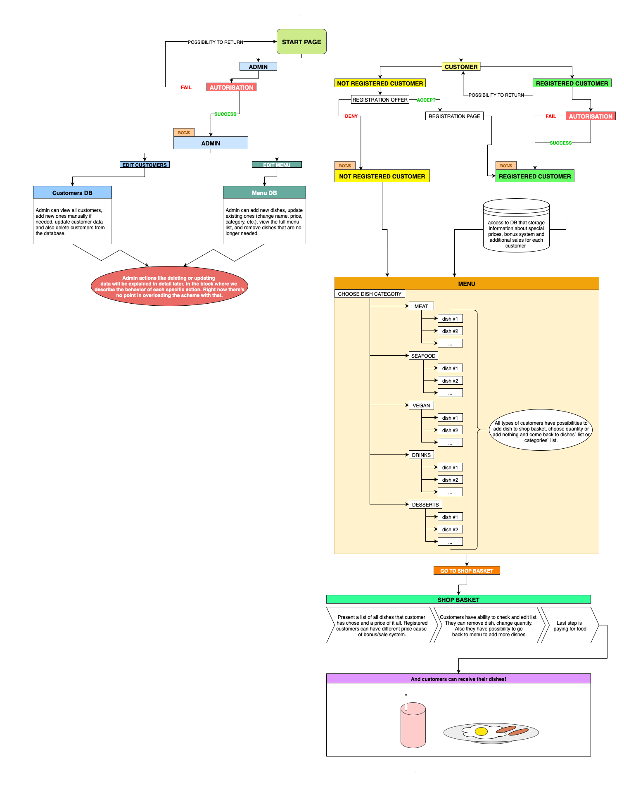
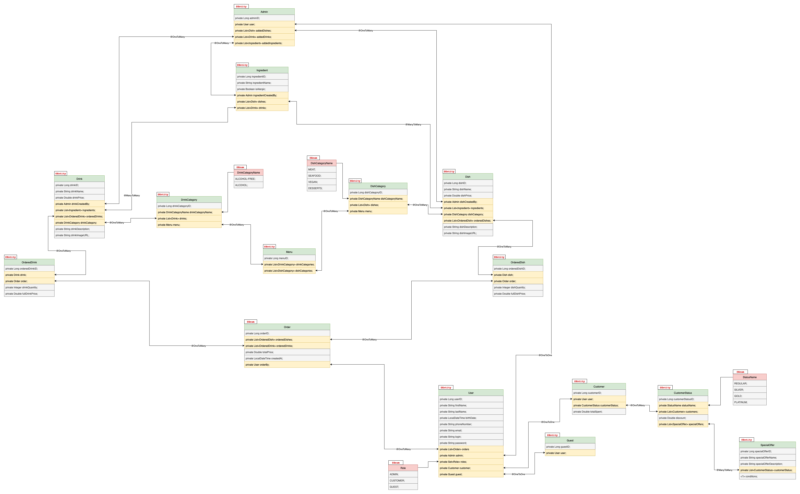

# Restaurant application 

---
**Yana Zavalniuk**  
Junior Java developer • Started: August 2025
---

Pet-project that simulating a restaurant system with all main functions, 
including customer management, staff authorization, and menu operations.

## TO DO LIST
- [x] Add `user-journey-scheme` with explanation of project`s idea and 
main functions.
- [ ] Create `layered-architecture-scheme` and describe task of each layer.
  - [ ] Presentation layer
  - [ ] Business logic layer
  - [ ] Domain layer
  - [ ] Data access layer
- [ ] 

## User journey
### Full user journey scheme below:

### Roles and access
- *ADMIN* can:
  - View the full list of customers.
  - Manually add new customers.
  - Edit existing customer data.
  - Delete customers from the database.
  - View and manage the full dish menu.
  - Add new dishes.
  - Update existing ones (name, price, category, etc.).
  - Remove dishes that are no longer available.
- *CUSTOMER* can:
  - Be registered or not registered.
  - Non-registered customers will be offered to register.
    - If they accept – registration form is shown.
    - If they decline – they continue browsing as guest.
  - Registered customers have:
    - Access to personalized bonuses.
    - Discounted prices (optional).
    - Additional features that will be explained in further user behavior sections.

### Menu and ordering flow
- All customers — both registered and not — can access the menu and browse available dishes.
- The menu is divided into categories: meat, seafood, vegan, drinks, desserts.
- There's also a Children's Menu, which works like a constructor. Users can choose options 
for each position: main dish, side dish, drink, dessert, toy. It's possible to skip positions if preferred.
- Each dish (from any menu section) can be:
  - Opened for details (description, ingredients, etc.).
  - Added to the shopping basket.
  - Chosen in any quantity or left unselected.
- After selecting dishes, users proceed to the shopping basket:
  - The basket displays all selected items and their prices.
  - Registered users may see different prices due to discounts, 
  bonus systems, or special offers.
- Customers can:
  - Edit quantities
  - Remove any dish
  - Return to the menu to add more
- When satisfied with the selection, the customer proceeds to payment.
- After payment, customers receive their order.

## Project architecture 
### Domain layer

#### *Key entities*

- **user**: the base entity for all types of system users. a user can have different roles such as `admin`, `customer`, or `guest`  
- **admin**: represents an administrator responsible for managing the system  
- **customer**: a registered user with additional attributes such as customer status and loyalty points  
- **guest**: a non-registered user who can still place orders
- **order**: the central entity that links customers/guests with the dishes they purchase. each order contains multiple ordered dishes  
- **ordered dish**: connects an order with specific dishes, including quantity information
- **menu**: contains a list of available dishes grouped by categories  
- **dish**: represents a meal item, which belongs to a specific dish category and consists of multiple ingredients  
- **ingredient**: basic building blocks of a dish, including details such as name and nutritional values  
- **dish category**: classification of dishes (meat, seafood, vegan, desserts)
- **customer status**: defines loyalty levels (regular, silver, gold, platinum)  
- **special offer**: linked with customer statuses to provide discounts or promotions

#### *Relationships*

- **user**: can be an admin, customer, or guest  
- **customer**: may have a customer status, which can be linked with special offers  
- **customer or guest**: can place multiple orders  
- **order**: consists of several ordered dishes  
- **ordered dish**: references a dish from the menu  
- **dish**: belongs to a dish category and can contain multiple ingredients  
- **menu**: groups dishes by categories 